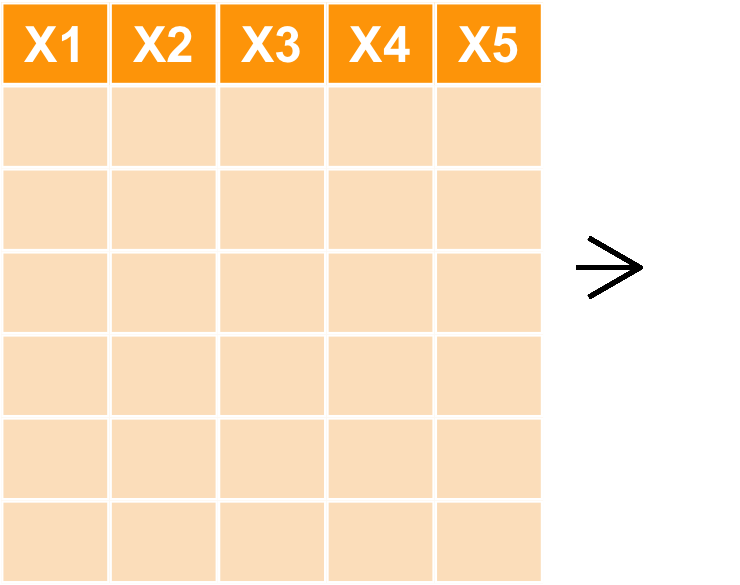
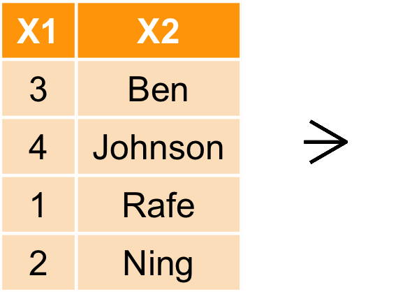
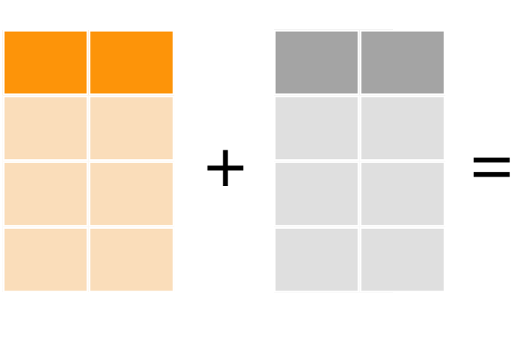
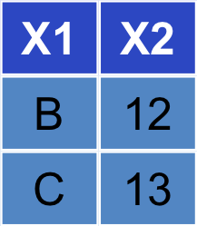

---
title       : ETL with R
subtitle    : 智庫驅動
author      : Ben Chen
job         : 
framework   : io2012-dsp
highlighter : highlight.js
hitheme     : zenburn
widgets     : [mathjax]            # {mathjax, quiz, bootstrap}
mode        : selfcontained # {standalone, draft}
knit        : slidify::knit2slides
geometry: margin=0in
--- 
## 今日重點!!!

### 整理資料

### Extraction, Transform and Load

### 需要的套件
    library(ggplot2)
    library(data.table)
    library(dplyr)
    library(reshape2)


```{r setup, include=FALSE, cache=FALSE}
suppressPackageStartupMessages({
  library(knitr)
  library(RColorBrewer)
  library(ggplot2)
  library(xtable)
  library(magrittr)
  library(data.table)
  library(broom)
  library(dplyr)
})
opts_chunk$set(echo = FALSE, cache = FALSE, cache.path = ".cache-EDA-R/")
options(width = 40)
fit100 <- fig <- function(path, size = 100) {
  sprintf("</img>", 
          path, size, size)
}
fit50 <- function(fname) fit100(fname, 50)
sys_name <- Sys.info()["sysname"] %>% tolower
sys_encode <- c("utf8", "utf8", "big5")[pmatch(sys_name, c("linux", "darwin", "windows"))]
thm <- theme(text=element_text(size=20))
las2 <- theme(axis.text.x = element_text(angle = 90, hjust = 1))
```

--- .dark .segue
## 確定自己的路徑

--- &vcenter .largecontent

```{r echo=TRUE}
getwd()
```
```{r echo=TRUE,eval=FALSE}
setwd('路徑')
```

--- &vcenter .largecontent

## 小技巧

- `tab`補齊指令
- `command`(or `control`)+ `enter`執行source指令
- `command`(or `control`)+ `shift`+ `c`註解或解除註解
- `command`+ 1 滑鼠游標移至source
- `command`+ 2 滑鼠游標移至Console
- `command`+ L 清除Console


--- .dark .segue
## 先讀檔

--- &vcenter .largecontent
## 讀檔之前，觀察檔案
### 編碼通常都是`UTF8`或`BIG5`
```{r,echo=TRUE,eval=FALSE}
raw <- readLines('檔案路徑', n = 10, encoding = "BIG-5")
```

--- &vcenter .largecontent
## 轉換編碼並存檔

```{r,echo=TRUE,eval=FALSE}
raw2 <- iconv(raw, from = "BIG-5", to = "UTF-8")
# 從big5轉utf8
write(raw2, "ubikeweatherutf8.csv")
# 存檔囉～～
```


--- &vcenter .largecontent
## 讀取ubike資料
```{r,echo=TRUE,eval=FALSE}
ubike = read.csv('檔案路徑', 
          colClasses = c("factor","integer","integer","factor","factor",
                         "numeric","numeric","integer","numeric","integer",
                         "integer","numeric","numeric", "integer","integer",
                         "numeric","numeric","numeric", "numeric","numeric",
                         "numeric"),fileEncoding = 'utf8')
# 以colClasses控制每個欄位的class，這可使讀檔加速
# 以fileEncoding定義檔案編碼
```
```{r loadubike, echo = FALSE, cache=TRUE,message=FALSE}
ubike_path <- sprintf("/Users/benjamin/test/data/ubikeweather%s.csv", sys_encode)
ubike = fread(ubike_path,
              data.table = FALSE,
              colClasses=c("factor","integer","integer","factor","factor","numeric","numeric","integer","numeric","integer","integer","numeric","numeric","integer","integer","numeric","numeric","numeric","numeric","numeric","numeric"))
# colnames(ubike) <- 
#   c("日期", "時間", "場站代號", "場站區域", "場站名稱", 
#   "緯度", "經度", "總停車格", "平均車輛數", "最大車輛數", 
#   "最小車輛數", "車輛數標準差", "平均空位數", "最大空位數", 
#   "最小空位數", "空位數標準差", "平均氣溫", "溼度", 
#   "氣壓", "最大風速", "降雨量")
```

--- &vcenter .largecontent
## 進階讀取
### fread是data.table裡的function
```{r echo=TRUE, eval=FALSE}
ubike = fread('檔案路徑',
          data.table = FALSE,
          colClasses = c("factor","integer","integer","factor",
                        "factor","numeric", "numeric", "integer",
                        "numeric", "integer","integer","numeric",
                        "numeric", "integer","integer","numeric",
                        "numeric","numeric", "numeric","numeric",
                        "numeric"))
```

--- &vcenter .largecontent
## 把欄位中文英文對照
```{r results='asis'}
chin=c("日期", "時間", "場站代號", "場站區域", "場站名稱", 
  "緯度", "經度", "總停車格", "平均車輛數", "最大車輛數", 
  "最小車輛數", "車輛數標準差", "平均空位數", "最大空位數", 
  "最小空位數", "空位數標準差", "平均氣溫", "溼度", 
  "氣壓", "最大風速", "降雨量")
coln=data.frame(matrix(data="",ncol=4,nrow=11),stringsAsFactors = FALSE)
coln$X1=chin[1:11]
coln$X2=colnames(ubike)[1:11]
coln$X3[1:10]=chin[12:21]
coln$X4[1:10]=colnames(ubike)[12:21]
kable(coln)
```

--- &vcenter .largecontent
## 把欄位換成中文
```{r echo=TRUE, eval=FALSE}
colnames(ubike) <- 
  c("日期", "時間", "場站代號", "場站區域", "場站名稱", 
  "緯度", "經度", "總停車格", "平均車輛數", "最大車輛數", 
  "最小車輛數", "車輛數標準差", "平均空位數", "最大空位數", 
  "最小空位數", "空位數標準差", "平均氣溫", "溼度", 
  "氣壓", "最大風速", "降雨量")
```


--- .dark .segue
## 讀完檔就是要取值啊～～不然要幹嘛


--- &vcenter .largecontent

## 取值- 座標
```{r echo=TRUE,eval=FALSE}
# head可以取出前幾列
head(ubike)
# tail可以取最後幾列
tail(ubike)
# 利用座標來取值，第一個數表示列位，第二個數表示欄位
ubike[3,2]
# 可一次選擇多列多欄
ubike[c(3:4),c(2:5,7)]
# 加上負號可剔除列位欄位
ubike[c(3:4),-c(6:21)]
```

--- &vcenter .largecontent

## 取值- 指定欄位
```{r echo=TRUE,eval=FALSE}
ubike[,4]
ubike[,"sna"]
ubike[["sna"]]
ubike$場站名稱
```

--- .dark .segue
## dplyr


--- .largecontent

## magrittr

- 壓縮的程式碼不好讀
- 展開的程式碼會產生很多暫存變數
- 套件`magrittr`部份解決了這個問題

```{r magrittr, echo = TRUE, results='hide'}

ans1 <- ubike$sna
ans1.1 <- unique(ans1) # unique可列出所有不重複的項目

unique(ubike$sna)

library(magrittr)
ubike$sna %>%
  unique
```

--- &vcenter .largecontent

## dplyr

- 讓R 使用者可以用更有彈性的方式來處理資料
- 針對`data.frame`做設計（名稱中的`d`）
- 設計理念
    - 導入資料整理最重要的動作（非常類似SQL）
    - 快
    - 支援異質資料源（`data.frame`或資料庫中的表格）

--- .largecontent

## 學習dplyr的官方方式：`vignette`

```{r dplyr-vignette, echo = TRUE, eval=FALSE}
vignette(all = TRUE, package = "dplyr")
vignette("introduction", package = "dplyr")
```

- 更詳細的dplyr介紹可以閱讀dplyr的小論文
- R 的開發者會針對一個主題撰寫小論文做介紹

--- &vcenter .largecontent

## dplyr簡介


- `filter` 對列做篩選
- `select` 對欄做篩選
- `mutate` 更改欄或新增欄
- `arrange` 排列
- `group_by`+`summarise` 分類
- 合併欄位


--- &vcenter .largecontent
## 情境
### 小明想在永和找到新房子，希望以後上下班都靠Ubike通勤，希望早上可以輕鬆租到車，下班後也可以輕鬆還車，請幫他找出中和區早上七點腳踏車最多的場站。

--- &vcenter .largecontent
## 中和區腳踏車

```{r}
ubike1<- select(ubike,hour,sarea,sna,avg.sbi) %>%
  filter(sarea=='中和區' & hour==7) %>%
  mutate(avg.sbi=floor(avg.sbi)) %>%
  group_by(sna) %>%
  summarise(avg_rate=mean(avg.sbi)) %>%
  arrange(avg_rate)
kable(ubike1)
```

--- &vcenter .largecontent

## select

</img>

--- &vcenter .largecontent

## select

- 選擇時間、場站區域、場站名稱平均車輛數

```{r,echo=TRUE}
ubike1<- select(ubike,hour,sarea,sna,avg.sbi)
```

```{r}
kable(head(ubike1))
```


--- &vcenter .largecontent

## filter

</img>


--- &vcenter .largecontent

## filter

- 過濾出中和區的資料

```{r,echo=TRUE}
ubike1<- select(ubike,hour,sarea,sna,avg.sbi) %>%
  filter(sarea=='中和區' & hour==7)
```
```{r}
kable(ubike1)
```

--- &vcenter .largecontent

## mutate

</img>

--- &vcenter .largecontent

## mutate

- 新增欄位計算有車率

```{r,echo=TRUE}
ubike1<- select(ubike,hour,sarea,sna,avg.sbi) %>%
  filter(sarea=='中和區' & hour==7) %>%
  mutate(avg.sbi=floor(avg.sbi))
```
```{r}
kable(head(ubike1))
```

--- &vcenter .largecontent

## group_by

</img>

--- &vcenter .largecontent

## group_by

- 將各站的數據群聚起來

```{r,echo=TRUE}
ubike1<- select(ubike,hour,sarea,sna,avg.sbi) %>%
  filter(sarea=='中和區' & hour==7) %>%
  mutate(avg.sbi=floor(avg.sbi)) %>%
  group_by(sna)
ubike1
```

--- &vcenter .largecontent

## summarise


</img></img>

--- &vcenter .largecontent

## summarise

```{r,echo=TRUE}
ubike1<- select(ubike,hour,sarea,sna,avg.sbi) %>%
  filter(sarea=='中和區' & hour==7) %>%
  mutate(avg.sbi=floor(avg.sbi)) %>%
  group_by(sna) %>%
  summarise(avg_rate=mean(avg.sbi))
```
```{r}
kable(ubike1)
```

--- &vcenter .largecontent

## arrange

</img></img>


--- &vcenter .largecontent

## arrange

```{r,echo=TRUE}
ubike1<- select(ubike,hour,sarea,sna,avg.sbi) %>%
  filter(sarea=='中和區' & hour==7) %>%
  mutate(avg.sbi=floor(avg.sbi)) %>%
  group_by(sna) %>%
  summarise(avg_rate=mean(avg.sbi)) %>%
  arrange(avg_rate)
```

```{r}
kable(ubike1)
```


--- &vcenter .largecontent

## 練習一下

### 小明發現住板橋的話，八點騎腳踏車就可以準時上班，還可以順便吃早餐，請幫忙找出板橋區各車站八點車子最多的站

--- &vcenter .largecontent

## 練習一下

### 小明發現住板橋的話，八點騎腳踏車就可以準時上班，還可以順便吃早餐，請幫忙找出板橋區各車站八點車子最多的站

```{r}
ubike2<- select(ubike,hour,sarea,sna,avg.sbi) %>%
  filter(sarea=='板橋區' & hour==8) %>%
  mutate(avg.sbi=floor(avg.sbi)) %>%
  group_by(sna) %>%
  summarise(avg_rate=mean(avg.sbi)) %>%
  arrange(avg_rate)
kable(ubike2)
```

--- &vcenter .largecontent

## 練習一下

### 小明喜歡玩遙控飛機，在中和希望找一個下午三點風比較小的地點吧

```{r}
ubike3<- select(ubike,hour,sarea,sna,max.anemo,lng,lat) %>%
  filter(sarea=='中和區',hour==15) %>%
  group_by(sna) %>%
  summarise(avg_anemo=mean(max.anemo))
  
kable(ubike3)
```

--- &vcenter .largecontent
## bind

    bind_rows(a,b)
    bind_cols(a,b)

</img>

--- &twocol .largecontent
## bind

*** =left
    bind_rows(a,b)
    
</img>

*** =right
    bind_cols(a,b)
    
</img>

--- &vcenter .largecontent
## bind
```{r echo=TRUE}
bind_rows(ubike1,ubike2)
```

--- &vcenter .largecontent
## bind
```{r echo=TRUE}
bind_cols(ubike1,ubike3)
```

--- &vcenter .largecontent
## join

    left_join(a,b,by=X1)
    right_join(a,b,by=X1)
    inner_join(a,b,by=X1)
    full_join(a,by=X1)
    
</img></img>

--- &vcenter .largecontent
## left_join

    left_join(a,b,by=X1)

</img></img></img>

--- &vcenter .largecontent
## right_join

    right_join(a,b,by=X1)

</img></img></img>


--- &vcenter .largecontent
## inner_join

    inner_join(a,b,by=X1)

</img></img></img>

--- &vcenter .largecontent
## full_join

    full_join(a,b,by=X1)

</img></img></img>

--- &vcenter .largecontent
## 練習一下
```{r echo=TRUE}
left_join(ubike1,ubike3)
```

--- &vcenter .largecontent
## 交集

    intersect(a,b)
</img></img></img>

--- &vcenter .largecontent
## 聯集

    union(a,b)
</img></img></img>

--- &vcenter .largecontent
## 差集

    setdiff(a,b)
</img></img></img>

--- .dark .segue
## reshape2

--- &vcenter .largecontent
## reshape2

- melt
  - wide format -> long format
- cast  
  - long format -> wide format
  - `dcast` for data.frame
  - `acast` for vector, matrix and array

--- &vcenter .largecontent
## melt

```{r echo=TRUE}
WP.melt=as.data.frame(WorldPhones)
WP.melt$year <- rownames(WP.melt)  
WP.melt=melt(WP.melt,id='year')
kable(head(WP.melt))
```

--- &vcenter .largecontent
## cast

```{r echo=TRUE}
WP.cast=dcast(WP.melt,year~variable,value.var="value") 
kable(WP.cast)
```

--- &vcenter .largecontent
## 練習一下
### 小明想知道中和區的腳踏車站晴天和雨天的使用率有何差別
- 提示
  - `filter`、`mutate`、`select`、`group_by`、`summarise`
  - `dcast`
```{r}
ubike4=filter(ubike, sarea=='中和區',hour==8) %>% 
  mutate(is.rain=rainfall>1) %>%
  mutate(is.rain=factor(is.rain, levels=c(FALSE, TRUE), 
                        labels = c("晴天","雨天"))) %>%
  select(date,  avg.bemp, sna, is.rain,tot) %>%
  group_by(sna,  is.rain) %>%
  summarise(use_rate=mean(avg.bemp/tot)) %>%
  dcast(sna~is.rain,value.var="use_rate")
kable(ubike4)
```

--- &vcenter .largecontent
## 學習資源
- [Data Wrangling](http://www.rstudio.com/wp-content/uploads/2015/02/data-wrangling-cheatsheet.pdf)
- [Introduction to dplyr](https://cran.rstudio.com/web/packages/dplyr/vignettes/introduction.html)


--- .dark .segue
## Team Project & Lunch time