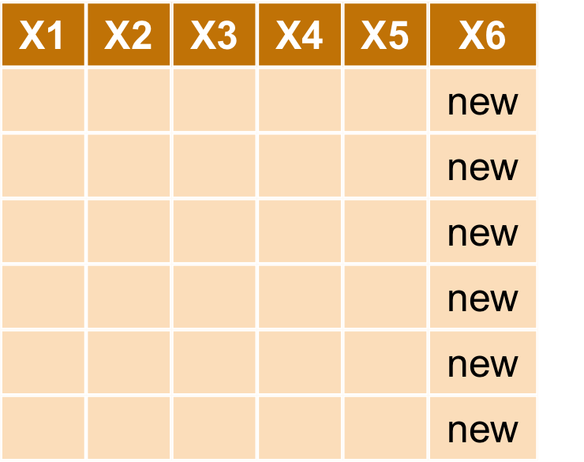
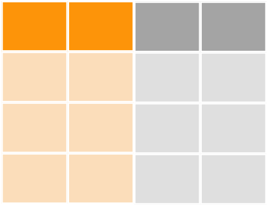
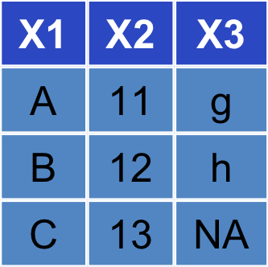
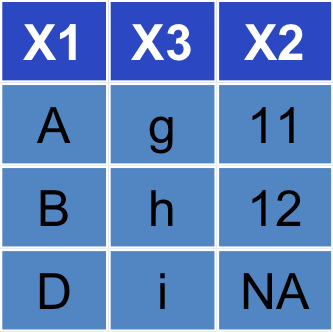
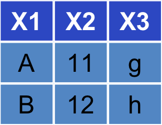
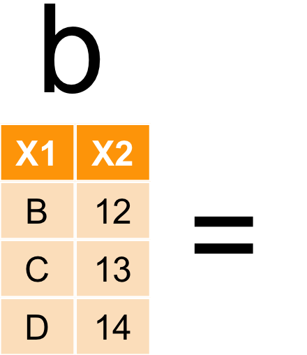
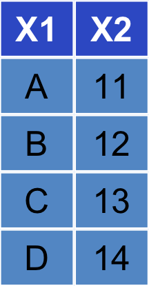

---
title       : ETL with R
subtitle    : 智庫驅動
author      : Ben Chen
job         : 
framework   : io2012-dsp
highlighter : highlight.js
hitheme     : zenburn
widgets     : [mathjax]            # {mathjax, quiz, bootstrap}
mode        : selfcontained # {standalone, draft}
knit        : slidify::knit2slides
geometry: margin=0in
--- 
## 今日重點!!!

### 整理資料

### Extraction, Transform and Load

### 需要的套件
    library(ggplot2)
    library(data.table)
    library(dplyr)
    library(reshape2)


--- .dark .segue
## 確定自己的路徑

--- &vcenter .largecontent


```r
getwd()
```

```
## [1] "/Users/benjamin/Ben"
```

```r
setwd('路徑')
```

--- &vcenter .largecontent

## 小技巧

- `tab`補齊指令
- `command`(or `control`)+ `enter`執行source指令
- `command`(or `control`)+ `shift`+ `c`註解或解除註解
- `command`+ 1 滑鼠游標移至source
- `command`+ 2 滑鼠游標移至Console
- `command`+ L 清除Console


--- .dark .segue
## 先讀檔

--- &vcenter .largecontent
## 讀檔之前，觀察檔案
### 編碼通常都是`UTF8`或`BIG5`

```r
raw <- readLines('檔案路徑', n = 10, encoding = "BIG-5")
```

--- &vcenter .largecontent
## 轉換編碼並存檔


```r
raw2 <- iconv(raw, from = "BIG-5", to = "UTF-8")
# 從big5轉utf8
write(raw2, "ubikeweatherutf8.csv")
# 存檔囉～～
```


--- &vcenter .largecontent
## 讀取ubike資料

```r
ubike = read.csv('檔案路徑', 
          colClasses = c("factor","integer","integer","factor","factor",
                         "numeric","numeric","integer","numeric","integer",
                         "integer","numeric","numeric", "integer","integer",
                         "numeric","numeric","numeric", "numeric","numeric",
                         "numeric"),fileEncoding = 'utf8')
# 以colClasses控制每個欄位的class，這可使讀檔加速
# 以fileEncoding定義檔案編碼
```

```
## 
Read 83.8% of 656711 rows
Read 656711 rows and 21 (of 21) columns from 0.108 GB file in 00:00:03
```

--- &vcenter .largecontent
## 進階讀取
### fread是data.table裡的function

```r
ubike = fread('檔案路徑',
          data.table = FALSE,
          colClasses = c("factor","integer","integer","factor",
                        "factor","numeric", "numeric", "integer",
                        "numeric", "integer","integer","numeric",
                        "numeric", "integer","integer","numeric",
                        "numeric","numeric", "numeric","numeric",
                        "numeric"))
```

--- &vcenter .largecontent
## 把欄位中文英文對照

|X1         |X2      |X3           |X4        |
|:----------|:-------|:------------|:---------|
|日期       |date    |車輛數標準差 |std.sbi   |
|時間       |hour    |平均空位數   |avg.bemp  |
|場站代號   |sno     |最大空位數   |max.bemp  |
|場站區域   |sarea   |最小空位數   |min.bemp  |
|場站名稱   |sna     |空位數標準差 |std.bemp  |
|緯度       |lat     |平均氣溫     |temp      |
|經度       |lng     |溼度         |humidity  |
|總停車格   |tot     |氣壓         |pressure  |
|平均車輛數 |avg.sbi |最大風速     |max.anemo |
|最大車輛數 |max.sbi |降雨量       |rainfall  |
|最小車輛數 |min.sbi |             |          |

--- &vcenter .largecontent
## 把欄位換成中文

```r
colnames(ubike) <- 
  c("日期", "時間", "場站代號", "場站區域", "場站名稱", 
  "緯度", "經度", "總停車格", "平均車輛數", "最大車輛數", 
  "最小車輛數", "車輛數標準差", "平均空位數", "最大空位數", 
  "最小空位數", "空位數標準差", "平均氣溫", "溼度", 
  "氣壓", "最大風速", "降雨量")
```


--- .dark .segue
## 讀完檔就是要取值啊～～不然要幹嘛


--- &vcenter .largecontent

## 取值- 座標

```r
# head可以取出前幾列
head(ubike)
# tail可以取最後幾列
tail(ubike)
# 利用座標來取值，第一個數表示列位，第二個數表示欄位
ubike[3,2]
# 可一次選擇多列多欄
ubike[c(3:4),c(2:5,7)]
# 加上負號可剔除列位欄位
ubike[c(3:4),-c(6:21)]
```

--- &vcenter .largecontent

## 取值- 指定欄位

```r
ubike[,4]
ubike[,"sna"]
ubike[["sna"]]
ubike$場站名稱
```

--- .dark .segue
## dplyr


--- .largecontent

## magrittr

- 壓縮的程式碼不好讀
- 展開的程式碼會產生很多暫存變數
- 套件`magrittr`部份解決了這個問題


```r
ans1 <- ubike$sna
ans1.1 <- unique(ans1) # unique可列出所有不重複的項目

unique(ubike$sna)

library(magrittr)
ubike$sna %>%
  unique
```

--- &vcenter .largecontent

## dplyr

- 讓R 使用者可以用更有彈性的方式來處理資料
- 針對`data.frame`做設計（名稱中的`d`）
- 設計理念
    - 導入資料整理最重要的動作（非常類似SQL）
    - 快
    - 支援異質資料源（`data.frame`或資料庫中的表格）

--- .largecontent

## 學習dplyr的官方方式：`vignette`


```r
vignette(all = TRUE, package = "dplyr")
vignette("introduction", package = "dplyr")
```

- 更詳細的dplyr介紹可以閱讀dplyr的小論文
- R 的開發者會針對一個主題撰寫小論文做介紹

--- &vcenter .largecontent

## dplyr簡介


- `filter` 對列做篩選
- `select` 對欄做篩選
- `mutate` 更改欄或新增欄
- `arrange` 排列
- `group_by`+`summarise` 分類
- 合併欄位


--- &vcenter .largecontent
## 情境
### 小明想在永和找到新房子，希望以後上下班都靠Ubike通勤，希望早上可以輕鬆租到車，下班後也可以輕鬆還車，請幫他找出中和區早上七點腳踏車最多的場站。

--- &vcenter .largecontent
## 中和區腳踏車


|sna              | avg_rate|
|:----------------|--------:|
|中和公園         | 13.56075|
|捷運永安市場站   | 17.51402|
|中和國民運動中心 | 27.63830|
|秀山國小         | 29.25234|

--- &vcenter .largecontent

## select

</img>

--- &vcenter .largecontent

## select

- 選擇時間、場站區域、場站名稱平均車輛數


```r
ubike1<- select(ubike,hour,sarea,sna,avg.sbi)
```


| hour|sarea  |sna                       | avg.sbi|
|----:|:------|:-------------------------|-------:|
|   15|信義區 |捷運市政府站(3號出口)     |  96.500|
|   15|大安區 |捷運國父紀念館站(2號出口) |  24.000|
|   15|信義區 |台北市政府                |  10.333|
|   15|信義區 |市民廣場                  |  39.333|
|   15|信義區 |興雅國中                  |  34.167|
|   15|信義區 |世貿二館                  |  31.333|


--- &vcenter .largecontent

## filter

</img>


--- &vcenter .largecontent

## filter

- 過濾出中和區的資料


```r
ubike1<- select(ubike,hour,sarea,sna,avg.sbi) %>%
  filter(sarea=='中和區' & hour==7)
```

| hour|sarea  |sna              | avg.sbi|
|----:|:------|:----------------|-------:|
|    7|中和區 |秀山國小         |   0.000|
|    7|中和區 |捷運永安市場站   |   1.733|
|    7|中和區 |中和公園         |   0.267|
|    7|中和區 |秀山國小         |  33.800|
|    7|中和區 |捷運永安市場站   |   6.467|
|    7|中和區 |中和公園         |   4.600|
|    7|中和區 |秀山國小         |  37.400|
|    7|中和區 |捷運永安市場站   |  12.867|
|    7|中和區 |中和公園         |   1.467|
|    7|中和區 |秀山國小         |  31.867|
|    7|中和區 |捷運永安市場站   |  19.267|
|    7|中和區 |中和公園         |  29.067|
|    7|中和區 |捷運永安市場站   |  13.600|
|    7|中和區 |中和公園         |   6.133|
|    7|中和區 |秀山國小         |  38.600|
|    7|中和區 |秀山國小         |  33.000|
|    7|中和區 |捷運永安市場站   |   1.600|
|    7|中和區 |中和公園         |   9.200|
|    7|中和區 |秀山國小         |  24.067|
|    7|中和區 |捷運永安市場站   |   4.733|
|    7|中和區 |中和公園         |   6.933|
|    7|中和區 |秀山國小         |  26.367|
|    7|中和區 |捷運永安市場站   |  20.867|
|    7|中和區 |中和公園         |   6.633|
|    7|中和區 |秀山國小         |  17.655|
|    7|中和區 |捷運永安市場站   |   7.931|
|    7|中和區 |中和公園         |  17.862|
|    7|中和區 |秀山國小         |  22.333|
|    7|中和區 |捷運永安市場站   |  13.333|
|    7|中和區 |中和公園         |   8.067|
|    7|中和區 |秀山國小         |  10.100|
|    7|中和區 |捷運永安市場站   |   6.533|
|    7|中和區 |中和公園         |  21.767|
|    7|中和區 |秀山國小         |  43.333|
|    7|中和區 |捷運永安市場站   |  13.600|
|    7|中和區 |中和公園         |  12.000|
|    7|中和區 |秀山國小         |  41.241|
|    7|中和區 |捷運永安市場站   |   6.207|
|    7|中和區 |中和公園         |   8.133|
|    7|中和區 |秀山國小         |  25.345|
|    7|中和區 |中和公園         |   2.414|
|    7|中和區 |捷運永安市場站   |   2.400|
|    7|中和區 |秀山國小         |  35.400|
|    7|中和區 |捷運永安市場站   |  10.000|
|    7|中和區 |中和公園         |   2.400|
|    7|中和區 |秀山國小         |  25.233|
|    7|中和區 |捷運永安市場站   |   1.167|
|    7|中和區 |中和公園         |   5.767|
|    7|中和區 |秀山國小         |  17.867|
|    7|中和區 |捷運永安市場站   |  16.333|
|    7|中和區 |中和公園         |  26.133|
|    7|中和區 |秀山國小         |  28.345|
|    7|中和區 |捷運永安市場站   |  13.724|
|    7|中和區 |中和公園         |   3.690|
|    7|中和區 |中和公園         |   7.000|
|    7|中和區 |秀山國小         |  18.536|
|    7|中和區 |捷運永安市場站   |   8.714|
|    7|中和區 |捷運永安市場站   |  23.167|
|    7|中和區 |秀山國小         |  23.828|
|    7|中和區 |中和公園         |  32.000|
|    7|中和區 |中和公園         |   4.100|
|    7|中和區 |秀山國小         |  25.241|
|    7|中和區 |捷運永安市場站   |   7.828|
|    7|中和區 |秀山國小         |  24.333|
|    7|中和區 |捷運永安市場站   |   7.400|
|    7|中和區 |中和公園         |  10.400|
|    7|中和區 |秀山國小         |  25.607|
|    7|中和區 |捷運永安市場站   |   8.800|
|    7|中和區 |中和公園         |  25.600|
|    7|中和區 |秀山國小         |  50.533|
|    7|中和區 |捷運永安市場站   |   2.178|
|    7|中和區 |中和公園         |   0.956|
|    7|中和區 |秀山國小         |  48.167|
|    7|中和區 |捷運永安市場站   |  18.714|
|    7|中和區 |中和公園         |  16.571|
|    7|中和區 |秀山國小         |  28.978|
|    7|中和區 |捷運永安市場站   |   8.356|
|    7|中和區 |中和公園         |  19.533|
|    7|中和區 |秀山國小         |  47.600|
|    7|中和區 |捷運永安市場站   |  16.800|
|    7|中和區 |中和公園         |  16.867|
|    7|中和區 |秀山國小         |  26.067|
|    7|中和區 |捷運永安市場站   |  16.711|
|    7|中和區 |中和公園         |   5.977|
|    7|中和區 |秀山國小         |  25.711|
|    7|中和區 |中和公園         |  16.022|
|    7|中和區 |捷運永安市場站   |  11.419|
|    7|中和區 |捷運永安市場站   |  16.644|
|    7|中和區 |秀山國小         |   7.267|
|    7|中和區 |中和公園         |  16.556|
|    7|中和區 |秀山國小         |   9.523|
|    7|中和區 |捷運永安市場站   |  28.778|
|    7|中和區 |中和公園         |  21.067|
|    7|中和區 |秀山國小         |  35.333|
|    7|中和區 |捷運永安市場站   |  17.311|
|    7|中和區 |中和公園         |  11.133|
|    7|中和區 |中和公園         |  14.978|
|    7|中和區 |秀山國小         |  37.578|
|    7|中和區 |捷運永安市場站   |  21.533|
|    7|中和區 |秀山國小         |  37.512|
|    7|中和區 |捷運永安市場站   |  22.488|
|    7|中和區 |中和公園         |  22.558|
|    7|中和區 |秀山國小         |   3.089|
|    7|中和區 |捷運永安市場站   |  27.778|
|    7|中和區 |中和公園         |  11.511|
|    7|中和區 |秀山國小         |   5.397|
|    7|中和區 |捷運永安市場站   |  22.362|
|    7|中和區 |中和公園         |  20.483|
|    7|中和區 |秀山國小         |  20.100|
|    7|中和區 |捷運永安市場站   |  23.729|
|    7|中和區 |中和公園         |  16.800|
|    7|中和區 |秀山國小         |  24.950|
|    7|中和區 |捷運永安市場站   |   7.136|
|    7|中和區 |中和公園         |  15.583|
|    7|中和區 |秀山國小         |  36.133|
|    7|中和區 |捷運永安市場站   |  12.683|
|    7|中和區 |中和公園         |  18.683|
|    7|中和區 |秀山國小         |  33.831|
|    7|中和區 |捷運永安市場站   |  15.492|
|    7|中和區 |中和公園         |  11.220|
|    7|中和區 |秀山國小         |  42.966|
|    7|中和區 |捷運永安市場站   |  21.983|
|    7|中和區 |中和公園         |  12.237|
|    7|中和區 |秀山國小         |  16.254|
|    7|中和區 |捷運永安市場站   |   7.492|
|    7|中和區 |中和公園         |  11.661|
|    7|中和區 |秀山國小         |  20.864|
|    7|中和區 |捷運永安市場站   |  18.068|
|    7|中和區 |中和公園         |  14.915|
|    7|中和區 |秀山國小         |  31.136|
|    7|中和區 |捷運永安市場站   |  20.746|
|    7|中和區 |中和公園         |  11.051|
|    7|中和區 |秀山國小         |  27.136|
|    7|中和區 |捷運永安市場站   |  18.373|
|    7|中和區 |中和公園         |   5.949|
|    7|中和區 |秀山國小         |  32.500|
|    7|中和區 |捷運永安市場站   |  21.483|
|    7|中和區 |中和公園         |  11.750|
|    7|中和區 |秀山國小         |  33.300|
|    7|中和區 |捷運永安市場站   |  43.733|
|    7|中和區 |中和公園         |  25.300|
|    7|中和區 |秀山國小         |  44.350|
|    7|中和區 |捷運永安市場站   |  28.000|
|    7|中和區 |中和公園         |   6.000|
|    7|中和區 |秀山國小         |  17.800|
|    7|中和區 |捷運永安市場站   |  14.683|
|    7|中和區 |中和公園         |   8.917|
|    7|中和區 |秀山國小         |  25.610|
|    7|中和區 |捷運永安市場站   |   6.593|
|    7|中和區 |中和公園         |   6.729|
|    7|中和區 |秀山國小         |  36.633|
|    7|中和區 |捷運永安市場站   |   7.683|
|    7|中和區 |中和公園         |   8.733|
|    7|中和區 |秀山國小         |  43.683|
|    7|中和區 |捷運永安市場站   |  15.933|
|    7|中和區 |中和公園         |   7.383|
|    7|中和區 |秀山國小         |  42.517|
|    7|中和區 |捷運永安市場站   |  19.967|
|    7|中和區 |中和公園         |   8.883|
|    7|中和區 |秀山國小         |  39.017|
|    7|中和區 |捷運永安市場站   |  10.431|
|    7|中和區 |中和公園         |  26.345|
|    7|中和區 |秀山國小         |  31.133|
|    7|中和區 |捷運永安市場站   |  10.133|
|    7|中和區 |中和公園         |  27.000|
|    7|中和區 |秀山國小         |  15.117|
|    7|中和區 |捷運永安市場站   |  19.017|
|    7|中和區 |中和公園         |   6.783|
|    7|中和區 |秀山國小         |  45.800|
|    7|中和區 |捷運永安市場站   |  12.800|
|    7|中和區 |中和公園         |   8.983|
|    7|中和區 |秀山國小         |  36.267|
|    7|中和區 |捷運永安市場站   |  12.333|
|    7|中和區 |中和公園         |  12.267|
|    7|中和區 |秀山國小         |  37.638|
|    7|中和區 |捷運永安市場站   |   7.069|
|    7|中和區 |中和公園         |   5.707|
|    7|中和區 |秀山國小         |  50.617|
|    7|中和區 |捷運永安市場站   |   5.900|
|    7|中和區 |中和公園         |  10.583|
|    7|中和區 |秀山國小         |  34.750|
|    7|中和區 |捷運永安市場站   |  17.033|
|    7|中和區 |中和公園         |  23.733|
|    7|中和區 |中和國民運動中心 |  28.000|
|    7|中和區 |秀山國小         |  33.483|
|    7|中和區 |捷運永安市場站   |  21.966|
|    7|中和區 |中和公園         |  17.897|
|    7|中和區 |中和國民運動中心 |  31.569|
|    7|中和區 |秀山國小         |  24.867|
|    7|中和區 |捷運永安市場站   |   7.633|
|    7|中和區 |中和公園         |   2.667|
|    7|中和區 |中和國民運動中心 |  25.000|
|    7|中和區 |秀山國小         |  34.300|
|    7|中和區 |捷運永安市場站   |  14.900|
|    7|中和區 |中和公園         |   5.000|
|    7|中和區 |中和國民運動中心 |  24.000|
|    7|中和區 |秀山國小         |  23.569|
|    7|中和區 |捷運永安市場站   |  16.948|
|    7|中和區 |中和公園         |  12.776|
|    7|中和區 |中和國民運動中心 |  21.017|
|    7|中和區 |秀山國小         |  37.800|
|    7|中和區 |捷運永安市場站   |   7.783|
|    7|中和區 |中和公園         |  11.650|
|    7|中和區 |中和國民運動中心 |  22.350|
|    7|中和區 |秀山國小         |  38.583|
|    7|中和區 |捷運永安市場站   |  14.933|
|    7|中和區 |中和公園         |   7.217|
|    7|中和區 |中和國民運動中心 |  10.667|
|    7|中和區 |秀山國小         |  28.153|
|    7|中和區 |捷運永安市場站   |  12.746|
|    7|中和區 |中和公園         |  14.000|
|    7|中和區 |中和國民運動中心 |  18.678|
|    7|中和區 |秀山國小         |  26.339|
|    7|中和區 |捷運永安市場站   |  12.644|
|    7|中和區 |中和公園         |   8.203|
|    7|中和區 |中和國民運動中心 |  30.305|
|    7|中和區 |秀山國小         |  31.649|
|    7|中和區 |捷運永安市場站   |  18.965|
|    7|中和區 |中和公園         |  14.877|
|    7|中和區 |中和國民運動中心 |  29.825|
|    7|中和區 |秀山國小         |  16.817|
|    7|中和區 |捷運永安市場站   |  15.067|
|    7|中和區 |中和公園         |  17.800|
|    7|中和區 |中和國民運動中心 |  28.133|
|    7|中和區 |秀山國小         |  39.000|
|    7|中和區 |捷運永安市場站   |  14.143|
|    7|中和區 |中和公園         |   9.000|
|    7|中和區 |中和國民運動中心 |  36.000|
|    7|中和區 |秀山國小         |  24.067|
|    7|中和區 |捷運永安市場站   |  23.650|
|    7|中和區 |中和公園         |  10.817|
|    7|中和區 |中和國民運動中心 |  31.233|
|    7|中和區 |秀山國小         |  35.133|
|    7|中和區 |捷運永安市場站   |   4.733|
|    7|中和區 |中和公園         |   1.867|
|    7|中和區 |中和國民運動中心 |  30.667|
|    7|中和區 |中和公園         |  16.333|
|    7|中和區 |秀山國小         |  34.267|
|    7|中和區 |捷運永安市場站   |  15.067|
|    7|中和區 |中和國民運動中心 |  28.600|
|    7|中和區 |秀山國小         |  26.400|
|    7|中和區 |捷運永安市場站   |  29.267|
|    7|中和區 |中和公園         |  15.533|
|    7|中和區 |中和國民運動中心 |  18.800|
|    7|中和區 |秀山國小         |  42.267|
|    7|中和區 |捷運永安市場站   |  33.467|
|    7|中和區 |中和公園         |  25.733|
|    7|中和區 |中和國民運動中心 |  28.800|
|    7|中和區 |秀山國小         |  27.267|
|    7|中和區 |捷運永安市場站   |  25.733|
|    7|中和區 |中和公園         |  21.333|
|    7|中和區 |中和國民運動中心 |  27.000|
|    7|中和區 |秀山國小         |  27.400|
|    7|中和區 |捷運永安市場站   |  28.667|
|    7|中和區 |中和公園         |  12.133|
|    7|中和區 |中和國民運動中心 |  33.000|
|    7|中和區 |秀山國小         |  15.133|
|    7|中和區 |捷運永安市場站   |  22.067|
|    7|中和區 |中和公園         |  11.867|
|    7|中和區 |中和國民運動中心 |  32.133|
|    7|中和區 |秀山國小         |  22.800|
|    7|中和區 |捷運永安市場站   |  16.000|
|    7|中和區 |中和公園         |  11.867|
|    7|中和區 |中和國民運動中心 |  30.800|
|    7|中和區 |秀山國小         |  45.600|
|    7|中和區 |捷運永安市場站   |  40.467|
|    7|中和區 |中和公園         |  18.000|
|    7|中和區 |中和國民運動中心 |  26.000|
|    7|中和區 |秀山國小         |  31.333|
|    7|中和區 |捷運永安市場站   |   8.733|
|    7|中和區 |中和公園         |  11.867|
|    7|中和區 |中和國民運動中心 |  35.000|
|    7|中和區 |秀山國小         |  36.267|
|    7|中和區 |捷運永安市場站   |  29.267|
|    7|中和區 |中和公園         |  25.133|
|    7|中和區 |中和國民運動中心 |  30.600|
|    7|中和區 |秀山國小         |   9.133|
|    7|中和區 |捷運永安市場站   |  22.133|
|    7|中和區 |中和公園         |  18.133|
|    7|中和區 |中和國民運動中心 |  21.600|
|    7|中和區 |秀山國小         |  37.600|
|    7|中和區 |捷運永安市場站   |  28.200|
|    7|中和區 |中和公園         |  16.067|
|    7|中和區 |中和國民運動中心 |  25.000|
|    7|中和區 |秀山國小         |  32.400|
|    7|中和區 |捷運永安市場站   |  51.333|
|    7|中和區 |中和公園         |  17.867|
|    7|中和區 |中和國民運動中心 |  24.600|
|    7|中和區 |秀山國小         |  19.933|
|    7|中和區 |捷運永安市場站   |  46.400|
|    7|中和區 |中和公園         |  24.133|
|    7|中和區 |中和國民運動中心 |  23.000|
|    7|中和區 |秀山國小         |  21.857|
|    7|中和區 |捷運永安市場站   |  21.500|
|    7|中和區 |中和公園         |  24.714|
|    7|中和區 |中和國民運動中心 |  24.500|
|    7|中和區 |秀山國小         |  33.800|
|    7|中和區 |捷運永安市場站   |  14.800|
|    7|中和區 |中和公園         |   4.067|
|    7|中和區 |中和國民運動中心 |  40.000|
|    7|中和區 |秀山國小         |  46.733|
|    7|中和區 |捷運永安市場站   |   9.400|
|    7|中和區 |中和公園         |   8.067|
|    7|中和區 |中和國民運動中心 |  42.333|
|    7|中和區 |秀山國小         |  28.400|
|    7|中和區 |捷運永安市場站   |   8.667|
|    7|中和區 |中和公園         |   2.867|
|    7|中和區 |中和國民運動中心 |  25.867|
|    7|中和區 |秀山國小         |  32.333|
|    7|中和區 |捷運永安市場站   |  23.867|
|    7|中和區 |中和公園         |  35.400|
|    7|中和區 |中和國民運動中心 |  33.933|
|    7|中和區 |秀山國小         |  36.200|
|    7|中和區 |捷運永安市場站   |  34.200|
|    7|中和區 |中和公園         |  18.400|
|    7|中和區 |中和國民運動中心 |  26.200|
|    7|中和區 |秀山國小         |  28.400|
|    7|中和區 |捷運永安市場站   |  15.533|
|    7|中和區 |中和公園         |  11.067|
|    7|中和區 |中和國民運動中心 |  27.267|
|    7|中和區 |秀山國小         |  19.267|
|    7|中和區 |捷運永安市場站   |  35.600|
|    7|中和區 |中和公園         |  28.133|
|    7|中和區 |中和國民運動中心 |  25.600|
|    7|中和區 |秀山國小         |  32.857|
|    7|中和區 |捷運永安市場站   |  46.786|
|    7|中和區 |中和公園         |  31.429|
|    7|中和區 |中和國民運動中心 |  35.286|
|    7|中和區 |秀山國小         |  35.067|
|    7|中和區 |捷運永安市場站   |  35.600|
|    7|中和區 |中和公園         |  25.400|
|    7|中和區 |中和國民運動中心 |  36.533|
|    7|中和區 |秀山國小         |  26.933|
|    7|中和區 |捷運永安市場站   |  34.067|
|    7|中和區 |中和公園         |  24.000|
|    7|中和區 |中和國民運動中心 |  29.000|
|    7|中和區 |秀山國小         |  34.867|
|    7|中和區 |捷運永安市場站   |  42.467|
|    7|中和區 |中和公園         |  26.933|
|    7|中和區 |中和國民運動中心 |  29.667|
|    7|中和區 |秀山國小         |  27.714|
|    7|中和區 |捷運永安市場站   |  10.857|
|    7|中和區 |中和公園         |   7.000|
|    7|中和區 |中和國民運動中心 |  33.000|
|    7|中和區 |秀山國小         |  36.357|
|    7|中和區 |捷運永安市場站   |  28.786|
|    7|中和區 |中和公園         |  14.357|
|    7|中和區 |中和國民運動中心 |  30.000|
|    7|中和區 |秀山國小         |  35.467|
|    7|中和區 |捷運永安市場站   |  17.800|
|    7|中和區 |中和公園         |  17.733|
|    7|中和區 |中和國民運動中心 |  21.000|
|    7|中和區 |秀山國小         |  37.533|
|    7|中和區 |捷運永安市場站   |  44.667|
|    7|中和區 |中和公園         |  18.667|
|    7|中和區 |中和國民運動中心 |  27.000|
|    7|中和區 |秀山國小         |  33.400|
|    7|中和區 |捷運永安市場站   |  23.067|
|    7|中和區 |中和公園         |  32.267|
|    7|中和區 |中和國民運動中心 |  27.800|
|    7|中和區 |秀山國小         |   4.333|
|    7|中和區 |捷運永安市場站   |  14.600|
|    7|中和區 |中和公園         |   4.667|
|    7|中和區 |中和國民運動中心 |  20.133|
|    7|中和區 |秀山國小         |  33.133|
|    7|中和區 |捷運永安市場站   |  27.933|
|    7|中和區 |中和公園         |  17.867|
|    7|中和區 |中和國民運動中心 |  27.867|

--- &vcenter .largecontent

## mutate

</img>

--- &vcenter .largecontent

## mutate

- 新增欄位計算有車率


```r
ubike1<- select(ubike,hour,sarea,sna,avg.sbi) %>%
  filter(sarea=='中和區' & hour==7) %>%
  mutate(avg.sbi=floor(avg.sbi))
```

| hour|sarea  |sna            | avg.sbi|
|----:|:------|:--------------|-------:|
|    7|中和區 |秀山國小       |       0|
|    7|中和區 |捷運永安市場站 |       1|
|    7|中和區 |中和公園       |       0|
|    7|中和區 |秀山國小       |      33|
|    7|中和區 |捷運永安市場站 |       6|
|    7|中和區 |中和公園       |       4|

--- &vcenter .largecontent

## group_by

</img>

--- &vcenter .largecontent

## group_by

- 將各站的數據群聚起來


```r
ubike1<- select(ubike,hour,sarea,sna,avg.sbi) %>%
  filter(sarea=='中和區' & hour==7) %>%
  mutate(avg.sbi=floor(avg.sbi)) %>%
  group_by(sna)
ubike1
```

```
## Source: local data frame [368 x 4]
## Groups: sna [4]
## 
##     hour  sarea            sna avg.sbi
##    (int)  (chr)          (chr)   (dbl)
## 1      7 中和區       秀山國小       0
## 2      7 中和區 捷運永安市場站       1
## 3      7 中和區       中和公園       0
## 4      7 中和區       秀山國小      33
## 5      7 中和區 捷運永安市場站       6
## 6      7 中和區       中和公園       4
## 7      7 中和區       秀山國小      37
## 8      7 中和區 捷運永安市場站      12
## 9      7 中和區       中和公園       1
## 10     7 中和區       秀山國小      31
## ..   ...    ...            ...     ...
```

--- &vcenter .largecontent

## summarise


</img></img>

--- &vcenter .largecontent

## summarise


```r
ubike1<- select(ubike,hour,sarea,sna,avg.sbi) %>%
  filter(sarea=='中和區' & hour==7) %>%
  mutate(avg.sbi=floor(avg.sbi)) %>%
  group_by(sna) %>%
  summarise(avg_rate=mean(avg.sbi))
```

|sna              | avg_rate|
|:----------------|--------:|
|捷運永安市場站   | 17.51402|
|秀山國小         | 29.25234|
|中和公園         | 13.56075|
|中和國民運動中心 | 27.63830|

--- &vcenter .largecontent

## arrange

</img></img>


--- &vcenter .largecontent

## arrange


```r
ubike1<- select(ubike,hour,sarea,sna,avg.sbi) %>%
  filter(sarea=='中和區' & hour==7) %>%
  mutate(avg.sbi=floor(avg.sbi)) %>%
  group_by(sna) %>%
  summarise(avg_rate=mean(avg.sbi)) %>%
  arrange(avg_rate)
```


|sna              | avg_rate|
|:----------------|--------:|
|中和公園         | 13.56075|
|捷運永安市場站   | 17.51402|
|中和國民運動中心 | 27.63830|
|秀山國小         | 29.25234|


--- &vcenter .largecontent

## 練習一下

### 小明發現住板橋的話，八點騎腳踏車就可以準時上班，還可以順便吃早餐，請幫忙找出板橋區各車站八點車子最多的站

--- &vcenter .largecontent

## 練習一下

### 小明發現住板橋的話，八點騎腳踏車就可以準時上班，還可以順便吃早餐，請幫忙找出板橋區各車站八點車子最多的站


|sna                   | avg_rate|
|:---------------------|--------:|
|永安公園              | 15.00000|
|捷運江子翠站(3號出口) | 23.33333|
|音樂公園              | 23.66667|
|板橋國民運動中心      | 24.33333|

--- &vcenter .largecontent

## 練習一下

### 小明喜歡玩遙控飛機，在中和希望找一個下午三點風比較小的地點吧


|sna              | avg_anemo|
|:----------------|---------:|
|捷運永安市場站   |  2.609531|
|秀山國小         |  3.033534|
|中和公園         |  2.698973|
|中和國民運動中心 |  2.177059|

--- &vcenter .largecontent
## bind

    bind_rows(a,b)
    bind_cols(a,b)

</img>

--- &twocol .largecontent
## bind

*** =left
    bind_rows(a,b)
    
</img>

*** =right
    bind_cols(a,b)
    
</img>

--- &vcenter .largecontent
## bind

```r
bind_rows(ubike1,ubike2)
```

```
## Source: local data frame [8 x 2]
## 
##                     sna avg_rate
##                   (chr)    (dbl)
## 1              中和公園 13.56075
## 2        捷運永安市場站 17.51402
## 3      中和國民運動中心 27.63830
## 4              秀山國小 29.25234
## 5              永安公園 15.00000
## 6 捷運江子翠站(3號出口) 23.33333
## 7              音樂公園 23.66667
## 8      板橋國民運動中心 24.33333
```

--- &vcenter .largecontent
## bind

```r
bind_cols(ubike1,ubike3)
```

```
## Source: local data frame [4 x 4]
## 
##                sna avg_rate
##              (chr)    (dbl)
## 1         中和公園 13.56075
## 2   捷運永安市場站 17.51402
## 3 中和國民運動中心 27.63830
## 4         秀山國小 29.25234
##                sna
##              (chr)
## 1   捷運永安市場站
## 2         秀山國小
## 3         中和公園
## 4 中和國民運動中心
## Variables not shown: avg_anemo (dbl)
```

--- &vcenter .largecontent
## join

    left_join(a,b,by=X1)
    right_join(a,b,by=X1)
    inner_join(a,b,by=X1)
    full_join(a,by=X1)
    
</img></img>

--- &vcenter .largecontent
## left_join

    left_join(a,b,by=X1)

</img></img></img>

--- &vcenter .largecontent
## right_join

    right_join(a,b,by=X1)

</img></img></img>


--- &vcenter .largecontent
## inner_join

    inner_join(a,b,by=X1)

</img></img></img>

--- &vcenter .largecontent
## full_join

    full_join(a,b,by=X1)

</img></img></img>

--- &vcenter .largecontent
## 練習一下

```r
left_join(ubike1,ubike3)
```

```
## Joining by: "sna"
```

```
## Source: local data frame [4 x 3]
## 
##                sna avg_rate avg_anemo
##              (chr)    (dbl)     (dbl)
## 1         中和公園 13.56075  2.698973
## 2   捷運永安市場站 17.51402  2.609531
## 3 中和國民運動中心 27.63830  2.177059
## 4         秀山國小 29.25234  3.033534
```

--- &vcenter .largecontent
## 交集

    intersect(a,b)
</img></img></img>

--- &vcenter .largecontent
## 聯集

    union(a,b)
</img></img></img>

--- &vcenter .largecontent
## 差集

    setdiff(a,b)
</img></img></img>

--- .dark .segue
## reshape2

--- &vcenter .largecontent
## reshape2

- melt
  - wide format -> long format
- cast  
  - long format -> wide format
  - `dcast` for data.frame
  - `acast` for vector, matrix and array

--- &vcenter .largecontent
## melt


```r
WP.melt=as.data.frame(WorldPhones)
WP.melt$year <- rownames(WP.melt)  
WP.melt=melt(WP.melt,id='year')
kable(head(WP.melt))
```


|year |variable | value|
|:----|:--------|-----:|
|1951 |N.Amer   | 45939|
|1956 |N.Amer   | 60423|
|1957 |N.Amer   | 64721|
|1958 |N.Amer   | 68484|
|1959 |N.Amer   | 71799|
|1960 |N.Amer   | 76036|

--- &vcenter .largecontent
## cast


```r
WP.cast=dcast(WP.melt,year~variable,value.var="value") 
kable(WP.cast)
```


|year | N.Amer| Europe| Asia| S.Amer| Oceania| Africa| Mid.Amer|
|:----|------:|------:|----:|------:|-------:|------:|--------:|
|1951 |  45939|  21574| 2876|   1815|    1646|     89|      555|
|1956 |  60423|  29990| 4708|   2568|    2366|   1411|      733|
|1957 |  64721|  32510| 5230|   2695|    2526|   1546|      773|
|1958 |  68484|  35218| 6662|   2845|    2691|   1663|      836|
|1959 |  71799|  37598| 6856|   3000|    2868|   1769|      911|
|1960 |  76036|  40341| 8220|   3145|    3054|   1905|     1008|
|1961 |  79831|  43173| 9053|   3338|    3224|   2005|     1076|

--- &vcenter .largecontent
## 練習一下
### 小明想知道中和區的腳踏車站晴天和雨天的使用率有何差別
- 提示
  - `filter`、`mutate`、`select`、`group_by`、`summarise`
  - `dcast`

|sna              |      晴天|      雨天|
|:----------------|---------:|---------:|
|捷運永安市場站   | 0.6671052| 0.6483044|
|秀山國小         | 0.4966519| 0.4436588|
|中和公園         | 0.6363115| 0.5917228|
|中和國民運動中心 | 0.4571795| 0.4603829|

--- &vcenter .largecontent
## 學習資源
- [Data Wrangling](http://www.rstudio.com/wp-content/uploads/2015/02/data-wrangling-cheatsheet.pdf)
- [Introduction to dplyr](https://cran.rstudio.com/web/packages/dplyr/vignettes/introduction.html)


--- .dark .segue
## Team Project & Lunch time
